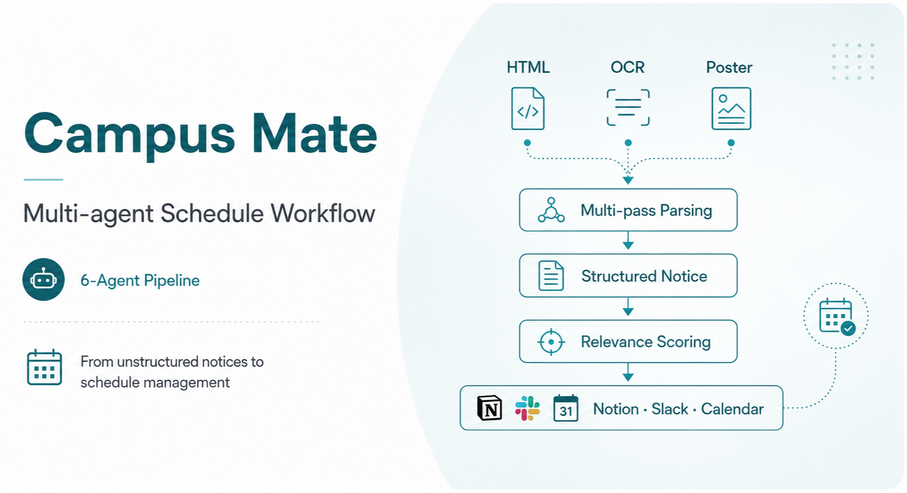
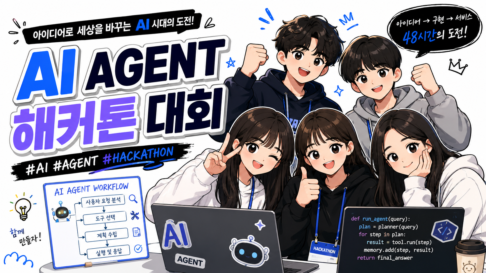
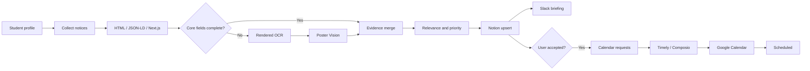

<div align="center">



# Campus Mate

**An AI Agent Harness that collects and structures university competition notices,<br/>then connects personalized recommendations to Notion approval, Slack briefings, and Google Calendar scheduling.**

<p>
  <a href="./README.md">한국어</a> · <strong>English</strong>
</p>


[](./LICENSE)


<br/>

<a href="https://youtu.be/dyarRcuLeIU">
  
</a>

</div>

---

## 🎯 The problem

University competition and extracurricular notices are scattered across career communities, school boards, and portal sites. Students repeatedly search for opportunities, read eligibility and submission requirements, extract deadlines, and then recreate the same information in a calendar.

Campus Mate connects that work into one flow: **collect → structure → recommend → approve → schedule**. Recommendations are gathered in a Notion dashboard, and only opportunities explicitly marked `Accept` by the user are added to Google Calendar. Slack is used as the briefing channel for recommended opportunities.

For the competition demo, we connected Python scripts, an LLM, and the Notion, Slack, and Google Calendar connectors through Timely to demonstrate the complete flow from notice collection to calendar scheduling. Afterward, we clarified the responsibilities of each Agent and Skill, reorganized the implementation, and added tests so the project could be shared in a more complete and reviewable form.

---

## 🎬 Demo

The video shows the Timely workflow from notice collection and structuring to relevance scoring, Notion storage, Slack briefing, and Google Calendar scheduling.

<p align="center">
  <a href="https://youtu.be/dyarRcuLeIU">
    
  </a>
</p>

<p align="center">
  <sub>Click the image to watch the demo on YouTube.</sub>
</p>

---

## 🧩 Agents, Skills, and execution code

Campus Mate uses Agents and Skills to define the order of work and the checks required at each stage. Python handles the repeatable execution tasks: collection, parsing, ranking, persistence, and external-service integrations.

```text
Harness layer
├── .claude/agents/       responsibilities, I/O contracts, and handoffs for 6 role Agents
├── .claude/skills/       methods and validation contracts for 12 Skills
├── CLAUDE.md             project invariants and operating principles
├── spec.md               functional and non-functional requirements
├── workflow.md           phases, partial reruns, and recovery rules
└── role-table.md         Agent ↔ Skill ↔ Python ↔ artifact mapping

Execution layer
├── src/campus_mate/      collection, parsing, ranking, Notion, Slack, and Calendar logic
├── tests/                unit and contract tests
├── timely/               schedules and connector mappings
└── examples/             deterministic fixtures that run without external accounts
```

Agents decide what must be checked before a result moves to the next stage. Python performs tasks that need to be reproducible, such as parsing, scoring, and API operations.

---

## 🤖 Six functional Agents

| Agent | Responsibility | Main output |
|---|---|---|
| `profile-manager` | Onboard school, year, major, and interests | validated `UserProfile` |
| `source-collector` | Discover new URLs from supported sites and remove duplicates | collection report |
| `multipass-parser` | HTML → OCR → Poster Vision with evidence merging | structured opportunities |
| `fit-priority` | Calculate relevance, priority, and recommendation reasons | recommendation fields |
| `notion-dashboard` | Perform non-destructive upserts while preserving user decisions | Notion page/state |
| `schedule-notification` | Check conflicts and connect Slack and Accept→Calendar actions | briefing/calendar artifacts |

### Timely automations

Timely combines the six roles above into three recurring operations.

| Automation | Schedule | Scope |
|---|---:|---|
| `daily-collector` | Daily at 08:00 | collect → parse → recommend → Notion → conflict check |
| `slack-briefing` | Daily at 09:00 | send recommended opportunities to Slack |
| `accept-sync` | Hourly | Notion `Accept` → Calendar → `Scheduled` |

---

## 🛠️ Twelve Skills

```text
orchestration
├── campus-mate-orchestrator
└── qa-audit

profile / collection
├── profile-build
└── source-watchlist-crawl

multi-pass parsing
├── html-opportunity-parse
├── rendered-page-ocr
├── poster-vision-extract
└── schema-merge-and-validate

recommendation / integration
├── recommendation-rank
├── notion-dashboard-sync
├── slack-brief-generate
└── calendar-sync
```

Each Skill documents its trigger conditions, inputs and outputs, validation gates, failure handling, and executable Python command. See [`role-table.md`](./role-table.md) for the detailed mapping.

---

## 🔄 End-to-end workflow



Notion manages each opportunity through the following statuses.

```text
New → Recommended → Accept → Scheduling → Scheduled
                     ├→ Hold
                     └→ Reject

Parsing review required: NeedsReview
Calendar failure: CalendarError → retry
```

- Scheduled collection runs do not overwrite `Accept`, `Hold`, `Reject`, or `Scheduled` decisions.
- Slack delivers recommendations; the participation decision is made in Notion.
- Google Calendar events are created only for opportunities marked `Accept`.
- If only some calendar events fail, successful event IDs are preserved and only failed items are retried.

---

## 🔍 Multi-pass parsing

The parser does not call every pass for every notice.

1. Extract decisive fields from JSON-LD, Next.js state, and visible HTML first.
2. Check whether core fields such as title, deadline, eligibility, and submissions are complete.
3. Run rendered OCR only when necessary.
4. Run Poster Vision when important information remains only in the poster image.
5. Merge results while preserving field-level `evidence`, `confidence`, and `warning` values.
6. Mark unresolved date or eligibility conflicts as `NeedsReview` and block automatic scheduling.

The fully supported collection source is currently **Linkareer**. OCR and Poster Vision are optional capabilities that require the corresponding runtime and model configuration.

---

## 🚀 Installation and execution

### 1. Set up the environment

```bash
python -m venv .venv
source .venv/bin/activate        # Windows: .venv\Scripts\activate
python -m pip install -e '.[ocr,vision,dev]'
python -m playwright install chromium
cp .env.example .env
```

Store live credentials only in `.env` or Timely Secrets.

### 2. Run the fixture demo without external accounts

```bash
mkdir -p data artifacts
cp examples/profile.example.json data/user_profile.json

CAMPUS_MATE_STORAGE_BACKEND=json \
  campus-mate demo \
  --fixture examples/fixtures/linkareer_detail.html \
  --output artifacts/demo-result.json

campus-mate list
```

### 3. Python CLI

```bash
campus-mate profile init
campus-mate collect --source linkareer --limit 8
campus-mate brief --dry-run --output artifacts/slack-briefing.json
campus-mate calendar plan --output artifacts/calendar-requests.json
campus-mate calendar apply \
  --requests artifacts/calendar-requests.json \
  --results artifacts/calendar-results.json
```

### 4. Claude Code Harness

Run Claude Code from the project root to use the definitions in `.claude/agents/` and `.claude/skills/`.

```text
/campus-mate-orchestrator status
/campus-mate-orchestrator onboard
/campus-mate-orchestrator demo
/campus-mate-orchestrator daily
/campus-mate-orchestrator brief
/campus-mate-orchestrator accept-sync
```

Natural-language requests follow the same contracts.

```text
Start the Campus Mate onboarding flow.
Run the full workflow with the fixture.
Collect today's notices and review the results before writing to Notion.
Generate the Slack briefing in dry-run mode.
Schedule only opportunities marked Accept in Notion.
```

---

## ⏱️ Timely integration

[`timely/automations.yaml`](./timely/automations.yaml) defines the reference commands and connector handoffs for the three recurring operations.

```text
08:00 daily-collector
09:00 slack-briefing
Hourly accept-sync
```

Python creates calendar requests with duplicate-prevention metadata. Timely/Composio creates the actual Google Calendar events, then returns the result to Python so the corresponding Notion status can be updated. Success and failure are recorded per event, allowing only failed items to be retried.

---

## ✅ Verification

```bash
python -m pytest -q
python scripts/validate_harness.py
python scripts/scan_secrets.py .
python -m compileall -q src scripts .claude/hooks
ruff check src tests scripts .claude/hooks
```

The checks cover:

- frontmatter and cross-references for 6 Agents and 12 Skills
- HTML/OCR/Vision merging and evidence tracking
- explainable relevance scoring
- non-destructive Notion upserts and state preservation
- Slack payload generation
- Calendar idempotency and partial-failure recovery
- absence of credential patterns

---

## 📁 Project structure

```text
campus-mate-ai-agent/
├── .claude/
│   ├── agents/                 # 6 functional Agents
│   ├── skills/                 # 12 Skills
│   ├── hooks/                  # secret guard / audit hooks
│   └── settings.json
├── .github/workflows/ci.yml
├── CLAUDE.md
├── spec.md
├── workflow.md
├── role-table.md
├── timely/
├── src/campus_mate/
├── tests/
├── examples/
├── scripts/
└── assets/
    ├── overview/
    └── demo/
```

The competition slides and speaking script are not included on GitHub. The README and Harness documents explain the project, while the source code, tests, and demo video show how it works.

---

## 👥 Project information

- **Project** — Campus Mate: automated university competition discovery and scheduling Agent
- **Event** — Harness Engineering: AI Agent & Skill Hackathon
- **Result** — Finalist, 7 of 12 teams
- **Team** — LEXUS
- **Members** — 최기범 · 박소은 · 신예진 · 이효경 · 임재성
- **Role (Gibum Choi)** — Architecture & Development Lead
- **Demo** — [YouTube](https://youtu.be/dyarRcuLeIU)

---

## 🔐 Security

Campus Mate integrates with external services such as Notion, Slack, and Google Calendar while keeping credentials and live user data outside the source code.

- Notion, Slack, and model API keys are injected through `.env` or Timely Secrets; `.env.example` lists variable names only.
- `.env`, personal profiles, real calendar data, runtime artifacts, and execution logs are excluded through `.gitignore`.
- `scripts/scan_secrets.py` and CI check the repository for common credential patterns.

---

## 📄 License

The original source code and project-authored documentation created by the LEXUS team are available under the [MIT License](./LICENSE).

The MIT License applies only to code and documentation authored by the team. Third-party trademarks and logos—including those of Notion, Slack, Google Calendar, Timely, and Claude—collected notice content, and other externally sourced materials remain subject to their respective owners and terms.
