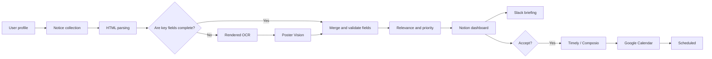

<div align="center">


# Campus Mate

<p>
  <a href="./README.md">한국어</a> · <strong>English</strong>
</p>

<strong>
An AI Agent Harness that collects and structures university competition notices,<br/>
then connects personalized recommendations to Notion, Slack, and Google Calendar
</strong>

<br/><br/>


[](./LICENSE)


<br/>

<a href="https://youtu.be/dyarRcuLeIU">
  
</a>

</div>

---

## 🎯 Overview

University competition and extracurricular notices are scattered across career communities, university boards, and portal sites. Eligibility, required submissions, deadlines, and event dates are also written in different formats, making them difficult to compare and manage manually.

Campus Mate connects this process into one workflow.

1. Collect new notices.
2. Parse HTML first, then use OCR and poster vision only when key information is missing.
3. Calculate relevance, priority, and recommendation reasons from the user profile and deadline.
4. Save the results to a Notion dashboard and send a Slack briefing.
5. Add only opportunities marked `Accept` in Notion to Google Calendar.

During the hackathon demo, Timely orchestrated the Python scripts, LLM, and external connectors. This public version expresses the same workflow through Claude Code Agent and Skill definitions, an executable Python layer, and automated tests.

---

## 🎬 Demo

The video shows the flow from notice collection and Notion storage to personalized recommendations, Slack briefing, and Google Calendar scheduling.

<p align="center">
  <a href="https://youtu.be/dyarRcuLeIU">
    
  </a>
</p>

<p align="center">
  <sub>Click the image to open the YouTube demo.</sub>
</p>

---

## 🔄 Workflow



Opportunity status in Notion is managed as follows.

```text
New → Recommended → Accept → Scheduling → Scheduled
                     ├→ Hold
                     └→ Reject

Manual review: NeedsReview
Calendar failure: CalendarError → retry
```

Recurring collection never overwrites user-selected `Accept`, `Hold`, `Reject`, or `Scheduled` states. Calendar requests contain idempotency keys; if only some events fail, successful event IDs are preserved and only failed items are retried.

---

## 🏗️ System design

| Component | Purpose |
|---|---|
| `.claude/agents/` | Responsibilities, input/output contracts, and handoffs for six functional Agents |
| `.claude/skills/` | Execution procedures, quality gates, and failure handling for each phase |
| `src/campus_mate/` | Collection, parsing, recommendation, Notion, Slack, and Calendar logic |
| `timely/automations.yaml` | Recurring schedules and external connector handoffs |
| `tests/` | Verification for parsing, scoring, state preservation, and calendar synchronization |

Detailed contracts are documented in [`CLAUDE.md`](./CLAUDE.md), [`spec.md`](./spec.md), [`workflow.md`](./workflow.md), and [`role-table.md`](./role-table.md).

### Six functional Agents

| Agent | Responsibility |
|---|---|
| `profile-manager` | Normalize school, grade, major, and interests into a recommendation profile |
| `source-collector` | Collect new notice URLs and remove duplicates |
| `multipass-parser` | Merge and validate HTML → OCR → Poster Vision results |
| `fit-priority` | Calculate relevance, deadline priority, and recommendation reasons |
| `notion-dashboard` | Perform non-destructive Notion upserts while preserving user states |
| `schedule-notification` | Check conflicts, create Slack briefings, and schedule accepted opportunities |

<details>
<summary><strong>View the 12 Skills</strong></summary>

```text
orchestration
├── campus-mate-orchestrator
└── qa-audit

profile / collection
├── profile-build
└── source-watchlist-crawl

multi-pass parsing
├── html-opportunity-parse
├── rendered-page-ocr
├── poster-vision-extract
└── schema-merge-and-validate

recommendation / integration
├── recommendation-rank
├── notion-dashboard-sync
├── slack-brief-generate
└── calendar-sync
```

</details>

---

## 🔍 Key implementation details

### Multi-pass parsing

The parser uses lighter sources first. It extracts decisive information from JSON-LD, Next.js state, and visible HTML, then runs OCR and poster vision only when required fields are missing. Each field retains evidence, confidence, and warnings. Unresolved date or eligibility conflicts are marked `NeedsReview` and are not scheduled automatically.

### Recommendation and priority

The scoring layer compares school, grade, major, interests, and activity types with each notice. It combines fit with time remaining until the deadline and stores an explainable recommendation reason.

### Approval-based scheduling

Notion is the source of truth for notice data and user decisions. Collection updates existing records instead of deleting them, and only notices marked `Accept` produce deadline, D-3 preparation, and event-date calendar requests.

---

## 🚀 Running the project

### 1. Install

```bash
python -m venv .venv
source .venv/bin/activate        # Windows: .venv\Scripts\activate
python -m pip install -e '.[ocr,vision,dev]'
python -m playwright install chromium
cp .env.example .env
```

Set Notion, Slack, and model credentials in `.env` or Timely Secrets. Never commit a populated `.env` file.

### 2. Run without external services

```bash
mkdir -p data artifacts
cp examples/profile.example.json data/user_profile.json

CAMPUS_MATE_STORAGE_BACKEND=json \
  campus-mate demo \
  --fixture examples/fixtures/linkareer_detail.html \
  --output artifacts/demo-result.json

campus-mate list
```

### 3. Main CLI commands

```bash
campus-mate profile init
campus-mate collect --source linkareer --limit 8
campus-mate brief --dry-run --output artifacts/slack-briefing.json
campus-mate calendar plan --output artifacts/calendar-requests.json
campus-mate calendar apply \
  --requests artifacts/calendar-requests.json \
  --results artifacts/calendar-results.json
```

### 4. Claude Code

Run Claude Code from the project root to use `.claude/agents/` and `.claude/skills/`.

```text
/campus-mate-orchestrator status
/campus-mate-orchestrator onboard
/campus-mate-orchestrator demo
/campus-mate-orchestrator daily
/campus-mate-orchestrator brief
/campus-mate-orchestrator accept-sync
```

---

## ⏱️ Timely automation

| Automation | Schedule | Scope |
|---|---:|---|
| `daily-collector` | 08:00 daily | Collect → parse → recommend → Notion → conflict check |
| `slack-briefing` | 09:00 daily | Send the recommended-opportunity briefing to Slack |
| `accept-sync` | Hourly | Notion `Accept` → Google Calendar → `Scheduled` |

Python prepares calendar request manifests, Timely/Composio executes the connector calls, and the results are returned to Python for Notion status updates.

---

## ✅ Verification

```bash
python -m pytest -q
python scripts/validate_harness.py
python scripts/scan_secrets.py .
ruff check src tests scripts .claude/hooks
```

The tests cover HTML/OCR/Vision merging, recommendation scoring, Notion state preservation, Slack payload generation, Calendar idempotency, and partial-failure recovery.

---

## 📌 Current scope

- The collector currently provides full support for **Linkareer**.
- OCR and Poster Vision are optional and require additional runtime and model configuration.
- Live Notion, Slack, and Google Calendar integration requires credentials and Timely connector setup for each service.

<details>
<summary><strong>View the project structure</strong></summary>

```text
campus-mate-ai-agent/
├── .claude/
│   ├── agents/
│   ├── skills/
│   └── hooks/
├── src/campus_mate/
├── timely/
├── tests/
├── examples/
├── scripts/
├── CLAUDE.md
├── spec.md
├── workflow.md
├── role-table.md
└── LICENSE
```

</details>

---

## 👥 Team

- **Team** — Nexus
- **Members** — 최기범 · 박소은 · 신예진 · 이효경 · 임재성
- **Architecture & Development Lead** — 최기범
- **Event** — Harness Engineering: AI Agent & Skill Hackathon
- **Result** — Finalist, 7 of 12 teams
- **Demo** — [YouTube](https://youtu.be/dyarRcuLeIU)

---

## 📄 License

Project-authored source code and Agent/Skill documentation are released under the [MIT License](./LICENSE). Third-party trademarks, logos, and content remain subject to their respective owners and terms.
