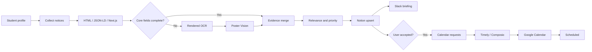

<div align="center">


# Campus Mate

**A code-backed AI agent harness that collects and structures university competition notices,<br/>ranks them for a student profile, and connects Notion approval, Slack briefings, and Google Calendar scheduling.**

<p>
  <a href="./README.md">한국어</a> · <strong>English</strong>
</p>


<br/>

<a href="https://youtu.be/dyarRcuLeIU">
  
</a>

</div>

---

## Problem

University competition and extracurricular notices are scattered across career communities, school boards, and portal sites. Students repeatedly search, read eligibility and submission requirements, extract dates, and manually recreate the same information in a calendar.

Campus Mate connects that work into one flow: **collect → structure → recommend → approve → schedule**. Recommendations are stored in a Notion dashboard. Slack delivers a one-way briefing, while Google Calendar receives only opportunities explicitly marked `Accept` by the user.

The original competition demo ran the workflow in Timely with Python scripts, an LLM, and external connectors. This repository is a public, consolidated version with explicit Agent/Skill contracts, tested Python modules, and safer state and credential handling.

---

## Demo

The video shows the end-to-end Timely flow from collection and parsing to relevance scoring, Notion storage, Slack briefing, and calendar synchronization.

<p align="center">
  <a href="https://youtu.be/dyarRcuLeIU">
    
  </a>
</p>

---

## Harness and execution layers

```text
Harness layer
├── .claude/agents/       responsibilities, I/O contracts, handoffs
├── .claude/skills/       methods, gates, recovery rules
├── CLAUDE.md             project invariants
├── spec.md               functional and non-functional requirements
├── workflow.md           phases, partial reruns, recovery
└── role-table.md         Agent ↔ Skill ↔ Python ↔ output mapping

Execution layer
├── src/campus_mate/      collection, parsing, ranking, integrations
├── tests/                unit and contract tests
├── timely/               schedules and connector handoffs
└── examples/             deterministic local fixtures
```

The harness decides **what may run, under which conditions, and what must be verified before handoff**. Python performs deterministic parsing, ranking, persistence, and integration work.

---

## Six functional agents

| Agent | Responsibility | Main output |
|---|---|---|
| `profile-manager` | Validate the student profile | `UserProfile` |
| `source-collector` | Discover and deduplicate supported notice URLs | collection report |
| `multipass-parser` | HTML → OCR → poster vision with evidence merge | structured opportunities |
| `fit-priority` | Explainable relevance and urgency ranking | recommendation fields |
| `notion-dashboard` | Non-destructive upsert and state preservation | Notion pages/state |
| `schedule-notification` | Conflicts, Slack, and Accept→Calendar | briefing/calendar artifacts |

Timely defines three **scheduled operations**, not three additional domain agents:

- `daily-collector` — daily at 08:00
- `slack-briefing` — daily at 09:00
- `accept-sync` — hourly

---

## Twelve skills

```text
campus-mate-orchestrator     qa-audit
profile-build                source-watchlist-crawl
html-opportunity-parse       rendered-page-ocr
poster-vision-extract        schema-merge-and-validate
recommendation-rank          notion-dashboard-sync
slack-brief-generate         calendar-sync
```

Each Skill documents trigger conditions, input/output contracts, quality gates, forbidden behavior, recovery, and executable Python commands.

---

## Workflow



```text
New → Recommended → Accept → Scheduling → Scheduled
                     ├→ Hold
                     └→ Reject

Parser ambiguity: NeedsReview
Calendar failure: CalendarError → retry
```

---

## Installation

```bash
python -m venv .venv
source .venv/bin/activate        # Windows: .venv\Scripts\activate
python -m pip install -e '.[ocr,vision,dev]'
python -m playwright install chromium
cp .env.example .env
```

### Deterministic fixture demo

```bash
mkdir -p data artifacts
cp examples/profile.example.json data/user_profile.json

CAMPUS_MATE_STORAGE_BACKEND=json \
  campus-mate demo \
  --fixture examples/fixtures/linkareer_detail.html \
  --output artifacts/demo-result.json

campus-mate list
```

### CLI

```bash
campus-mate profile init
campus-mate collect --source linkareer --limit 8
campus-mate brief --dry-run --output artifacts/slack-briefing.json
campus-mate calendar plan --output artifacts/calendar-requests.json
campus-mate calendar apply \
  --requests artifacts/calendar-requests.json \
  --results artifacts/calendar-results.json
```

### Claude Code

```text
/campus-mate-orchestrator status
/campus-mate-orchestrator onboard
/campus-mate-orchestrator demo
/campus-mate-orchestrator daily
/campus-mate-orchestrator brief
/campus-mate-orchestrator accept-sync
```

---

## Current scope

- Fully supported collection adapter: **Linkareer**
- Optional OCR: Playwright and Tesseract
- Optional poster vision: configured compatible vision endpoint
- Notion: dashboard, status, poster, structured fields, recommendation metadata
- Slack: one-way briefing
- Calendar: idempotent Timely/Composio request-result bridge

Optional or unconfigured functions are not presented as active production capabilities.

---

## Verification

```bash
python -m pytest -q
python scripts/validate_harness.py
python scripts/scan_secrets.py .
python -m compileall -q src scripts .claude/hooks
ruff check src tests scripts .claude/hooks
```

The checks cover the six Agent and twelve Skill contracts, multipass parsing, explainable ranking, non-destructive Notion upsert, Slack payloads, calendar idempotency and partial-failure recovery, and secret patterns.

---

## Project

- **Event** — Harness Engineering: AI Agent & Skill Hackathon
- **Result** — Finalist, 7 of 12 teams
- **Role** — Team · Architecture & Development Lead
- **Demo** — [YouTube](https://youtu.be/dyarRcuLeIU)

Presentation files and the internal speaking script are intentionally excluded from this repository. The README, harness contracts, source code, tests, and demo video form the public project record.

---

## Security and use

Runtime profiles, personal schedules, tokens, logs, and external-service data are excluded from Git. Secrets must be stored in environment variables or Timely Secrets.

No open-source license is granted at this time. A license may be added after agreement among the team contributors. Third-party trademarks, notices, and service content remain subject to their respective owners and terms.
