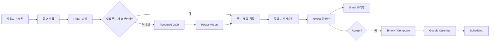

<div align="center">


# Campus Mate

<p>
  <strong>한국어</strong> · <a href="./README.en.md">English</a>
</p>

<strong>
여러 곳에 흩어진 대학생 공모전 공고를 수집·구조화하고,<br/>
개인화 추천과 일정 관리를 Notion·Slack·Google Calendar로 연결하는 AI Agent Harness
</strong>

<br/><br/>


[](./LICENSE)


<br/>

<a href="https://youtu.be/dyarRcuLeIU">
  
</a>

</div>

---

## 🎯 프로젝트 개요

대학생 공모전과 대외활동 정보는 커리어 커뮤니티, 학교 게시판, 포털 등 여러 경로에 흩어져 있습니다. 공고마다 참가 자격, 제출물, 마감일과 행사 일정의 표현도 달라 직접 비교하고 관리하기 어렵습니다.

Campus Mate는 이 과정을 하나의 흐름으로 연결합니다.

1. 신규 공고를 수집합니다.
2. HTML을 우선 분석하고, 필요한 경우 OCR과 포스터 Vision으로 누락 정보를 보완합니다.
3. 사용자 프로필과 마감일을 기준으로 적합도·우선순위·추천 이유를 계산합니다.
4. 결과를 Notion 현황판에 저장하고 Slack으로 브리핑합니다.
5. 사용자가 Notion에서 `Accept`한 공고만 Google Calendar에 반영합니다.

대회 시연에서는 Timely가 Python 스크립트와 LLM, 외부 커넥터를 조율했습니다. 공개된 코드는 같은 흐름을 Claude Code의 Agent·Skill 정의, Python 실행 계층과 자동 테스트로 정리한 버전입니다.

---

## 🎬 시연

공고 수집부터 Notion 저장, 맞춤 추천, Slack 브리핑과 Google Calendar 반영까지의 흐름을 영상에서 확인할 수 있습니다.

<p align="center">
  <a href="https://youtu.be/dyarRcuLeIU">
    
  </a>
</p>

<p align="center">
  <sub>이미지를 클릭하면 YouTube 시연 영상으로 이동합니다.</sub>
</p>

---

## 🔄 동작 흐름



Notion의 공고 상태는 다음과 같이 관리합니다.

```text
New → Recommended → Accept → Scheduling → Scheduled
                     ├→ Hold
                     └→ Reject

검토 필요: NeedsReview
일정 생성 실패: CalendarError → 재시도
```

정기 수집 과정에서는 사용자가 선택한 `Accept`, `Hold`, `Reject`, `Scheduled` 상태를 덮어쓰지 않습니다. 캘린더 요청에는 중복 방지 키를 포함하며, 일부 일정 생성에 실패하면 성공한 event ID는 유지하고 실패한 항목만 다시 처리합니다.

---

## 🏗️ 시스템 구성

| 구성 | 역할 |
|---|---|
| `.claude/agents/` | 여섯 기능 Agent의 책임, 입력·출력과 handoff 정의 |
| `.claude/skills/` | 단계별 실행 절차, 품질 기준과 실패 처리 정의 |
| `src/campus_mate/` | 수집·파싱·추천·Notion·Slack·Calendar 처리 코드 |
| `timely/automations.yaml` | 정기 실행 주기와 외부 커넥터 handoff |
| `tests/` | 파싱, 추천, 상태 보존과 일정 동기화 검증 |

세부 내용은 [`CLAUDE.md`](./CLAUDE.md), [`spec.md`](./spec.md), [`workflow.md`](./workflow.md), [`role-table.md`](./role-table.md)에 정리되어 있습니다.

### 6개 기능 Agent

| Agent | 책임 |
|---|---|
| `profile-manager` | 학교·학년·전공·관심 분야를 추천 프로필로 구조화 |
| `source-collector` | 신규 공고 URL 수집과 중복 제거 |
| `multipass-parser` | HTML → OCR → Poster Vision 결과 병합·검증 |
| `fit-priority` | 적합도, 마감 우선순위와 추천 이유 계산 |
| `notion-dashboard` | Notion 비파괴 upsert와 사용자 상태 보존 |
| `schedule-notification` | 충돌 확인, Slack 브리핑, Accept 공고 일정화 |

<details>
<summary><strong>12개 Skill 보기</strong></summary>

```text
orchestration
├── campus-mate-orchestrator
└── qa-audit

profile / collection
├── profile-build
└── source-watchlist-crawl

multi-pass parsing
├── html-opportunity-parse
├── rendered-page-ocr
├── poster-vision-extract
└── schema-merge-and-validate

recommendation / integration
├── recommendation-rank
├── notion-dashboard-sync
├── slack-brief-generate
└── calendar-sync
```

</details>

---

## 🔍 핵심 구현

### 멀티패스 파싱

파싱은 가벼운 출처부터 순서대로 사용합니다. JSON-LD, Next.js 상태와 visible HTML에서 핵심 정보를 먼저 추출하고, 필드가 부족할 때만 OCR과 Poster Vision을 실행합니다. 각 필드에는 출처 근거와 신뢰도, 경고를 함께 남기며 해결되지 않은 날짜·자격 충돌은 `NeedsReview`로 분류합니다.

### 추천과 우선순위

학교, 학년, 전공, 관심 분야와 활동 유형을 공고 정보와 비교해 적합도를 계산합니다. 마감일까지 남은 기간을 함께 고려해 우선순위를 정하고, 결과를 설명할 수 있도록 추천 이유를 저장합니다.

### 승인 기반 일정 관리

Notion은 공고 정보와 사용자 결정의 기준이 됩니다. 정기 수집은 기존 공고를 삭제하지 않고 갱신하며, 사용자가 `Accept`한 공고에 대해서만 마감·D-3 준비·행사 일정을 생성합니다.

---

## 🚀 실행 방법

### 1. 설치

```bash
python -m venv .venv
source .venv/bin/activate        # Windows: .venv\Scripts\activate
python -m pip install -e '.[ocr,vision,dev]'
python -m playwright install chromium
cp .env.example .env
```

Notion·Slack·모델 API 키는 `.env` 또는 Timely Secrets에 설정합니다. 실제 값이 들어 있는 `.env`는 Git에 커밋하지 않습니다.

### 2. 외부 서비스 없이 실행

```bash
mkdir -p data artifacts
cp examples/profile.example.json data/user_profile.json

CAMPUS_MATE_STORAGE_BACKEND=json \
  campus-mate demo \
  --fixture examples/fixtures/linkareer_detail.html \
  --output artifacts/demo-result.json

campus-mate list
```

### 3. 주요 CLI

```bash
campus-mate profile init
campus-mate collect --source linkareer --limit 8
campus-mate brief --dry-run --output artifacts/slack-briefing.json
campus-mate calendar plan --output artifacts/calendar-requests.json
campus-mate calendar apply \
  --requests artifacts/calendar-requests.json \
  --results artifacts/calendar-results.json
```

### 4. Claude Code

프로젝트 루트에서 Claude Code를 실행하면 `.claude/agents/`와 `.claude/skills/`를 사용할 수 있습니다.

```text
/campus-mate-orchestrator status
/campus-mate-orchestrator onboard
/campus-mate-orchestrator demo
/campus-mate-orchestrator daily
/campus-mate-orchestrator brief
/campus-mate-orchestrator accept-sync
```

---

## ⏱️ Timely 자동화

| 자동화 | 주기 | 실행 범위 |
|---|---:|---|
| `daily-collector` | 매일 08:00 | 수집 → 파싱 → 추천 → Notion → 충돌 확인 |
| `slack-briefing` | 매일 09:00 | 추천 공고 Slack 브리핑 |
| `accept-sync` | 매시 정각 | Notion `Accept` → Google Calendar → `Scheduled` |

Google Calendar 이벤트 생성은 Python이 요청 목록을 만들고, Timely/Composio가 커넥터를 실행한 뒤 결과를 다시 전달하는 방식으로 구성했습니다.

---

## ✅ 검증

```bash
python -m pytest -q
python scripts/validate_harness.py
python scripts/scan_secrets.py .
ruff check src tests scripts .claude/hooks
```

테스트는 HTML/OCR/Vision 결과 병합, 추천 점수, Notion 상태 보존, Slack payload, Calendar 중복 방지와 부분 실패 복구를 확인합니다.

---

## 📌 현재 범위

- 공고 수집기는 현재 **Linkareer**를 완전 지원합니다.
- OCR과 Poster Vision은 선택 기능이며, 추가 런타임과 모델 설정이 필요합니다.
- 실제 Notion·Slack·Google Calendar 연동에는 각 서비스의 인증정보와 Timely 커넥터 설정이 필요합니다.

<details>
<summary><strong>프로젝트 구조 보기</strong></summary>

```text
campus-mate-ai-agent/
├── .claude/
│   ├── agents/
│   ├── skills/
│   └── hooks/
├── src/campus_mate/
├── timely/
├── tests/
├── examples/
├── scripts/
├── CLAUDE.md
├── spec.md
├── workflow.md
├── role-table.md
└── LICENSE
```

</details>

---

## 👥 팀

- **Team** — Nexus
- **Members** — 최기범 · 박소은 · 신예진 · 이효경 · 임재성
- **Architecture & Development Lead** — 최기범
- **Event** — Harness Engineering: AI Agent & Skill Hackathon
- **Result** — Finalist, 7 of 12 teams
- **Demo** — [YouTube](https://youtu.be/dyarRcuLeIU)

---

## 📄 라이선스

프로젝트에서 작성한 소스 코드와 Agent·Skill 문서는 [MIT License](./LICENSE)로 공개합니다. 외부 서비스의 상표·로고와 제3자 콘텐츠에는 각 권리자의 이용조건이 적용됩니다.
