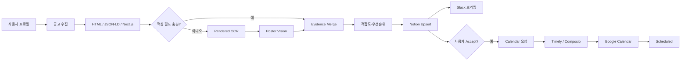

<div align="center">


# Campus Mate

**대학생 공모전 정보를 수집·구조화하고,<br/>개인화 추천부터 Notion 승인·Slack 브리핑·Google Calendar 반영까지 연결하는 code-backed AI Agent Harness**

<p>
  <strong>한국어</strong> · <a href="./README.en.md">English</a>
</p>


<br/>

<a href="https://youtu.be/dyarRcuLeIU">
  
</a>

</div>

---

## 🎯 해결하려는 문제

대학생 공모전과 대외활동 정보는 커리어 커뮤니티, 학교 게시판, 포털 등 여러 경로에 흩어져 있습니다. 사용자는 매번 직접 검색하고, 모집 자격·제출물·마감일을 읽어 정리한 뒤 다시 캘린더에 옮겨야 합니다.

Campus Mate는 이 반복 과정을 **수집 → 구조화 → 추천 → 승인 → 일정화**의 하나의 워크플로로 연결합니다. 추천 결과는 Notion 현황판에 모으고, 사용자가 `Accept`로 승인한 공고만 Google Calendar에 반영합니다. Slack은 추천 내용을 전달하는 브리핑 채널로 사용합니다.

대회 당시에는 Timely에서 Python 스크립트와 LLM, 외부 커넥터를 조합해 실제 흐름을 시연했습니다. 현재 저장소는 그 구현을 정리하고, Agent·Skill 계약과 테스트 가능한 Python 실행 계층을 보완한 공개용 버전입니다.

---

## 🎬 시연

Timely에서 파이프라인을 시작한 뒤 공고 수집, 구조화, 적합도 계산, Notion 저장, Slack 브리핑과 Google Calendar 반영으로 이어지는 흐름을 확인할 수 있습니다.

<p align="center">
  <a href="https://youtu.be/dyarRcuLeIU">
    
  </a>
</p>

<p align="center">
  <sub>이미지를 클릭하면 YouTube 시연 영상으로 이동합니다.</sub>
</p>

---

## 🧩 구조: Harness + 실행 코드

이 저장소는 프롬프트 문서만 모아둔 하네스도, 정책 없이 코드만 실행하는 애플리케이션도 아닙니다.

```text
Harness layer
├── .claude/agents/       6개 역할 Agent의 책임·입출력·handoff
├── .claude/skills/       12개 단계별 방법론·검증 계약
├── CLAUDE.md             프로젝트 불변식과 실행 원칙
├── spec.md               기능·비기능 요구사항
├── workflow.md           phase, 재실행, 복구 규칙
└── role-table.md         Agent ↔ Skill ↔ Python ↔ 산출물 매핑

Execution layer
├── src/campus_mate/      수집·파싱·추천·Notion·Slack·Calendar 로직
├── tests/                단위·계약 테스트
├── timely/               반복 실행 스케줄과 connector 매핑
└── examples/             외부 연결 없는 재현용 fixture
```

Agent는 **무엇을, 어떤 조건에서, 어디까지 수행할지**를 결정합니다. Python 코드는 수집·파싱·점수 계산·API 연동처럼 재현 가능한 작업을 수행합니다.

---

## 🤖 6개 기능 Agent

| Agent | 책임 | 핵심 산출물 |
|---|---|---|
| `profile-manager` | 학교·학년·전공·관심 분야 온보딩 | 검증된 `UserProfile` |
| `source-collector` | 지원 사이트 신규 URL 수집·중복 제거 | collection report |
| `multipass-parser` | HTML → OCR → Poster Vision, 근거 병합 | structured opportunities |
| `fit-priority` | 적합도·우선순위·추천 이유 계산 | recommendation fields |
| `notion-dashboard` | 비파괴 upsert와 사용자 상태 보존 | Notion page/state |
| `schedule-notification` | 충돌 확인·Slack·Accept→Calendar | briefing/calendar artifacts |

### Timely 반복 실행 단위

Timely의 세 자동화는 별도 전문 Agent가 아니라, 위 6개 역할을 일정에 맞게 조합하는 **운영 스케줄**입니다.

| 자동화 | 주기 | 실행 범위 |
|---|---:|---|
| `daily-collector` | 매일 08:00 | 수집 → 파싱 → 추천 → Notion → 충돌 확인 |
| `slack-briefing` | 매일 09:00 | 추천 공고 Slack 브리핑 |
| `accept-sync` | 매시 정각 | Notion `Accept` → Calendar → `Scheduled` |

---

## 🛠️ 12개 Skill

```text
orchestration
├── campus-mate-orchestrator
└── qa-audit

profile / collection
├── profile-build
└── source-watchlist-crawl

multi-pass parsing
├── html-opportunity-parse
├── rendered-page-ocr
├── poster-vision-extract
└── schema-merge-and-validate

recommendation / integration
├── recommendation-rank
├── notion-dashboard-sync
├── slack-brief-generate
└── calendar-sync
```

각 Skill은 호출 조건, 입력·출력 계약, 품질 게이트, 금지 동작, 실패 처리와 실제 Python 명령을 명시합니다. 세부 역할은 [`role-table.md`](./role-table.md)에서 확인할 수 있습니다.

---

## 🔄 전체 워크플로



상태 전이는 다음 원칙을 따릅니다.

```text
New → Recommended → Accept → Scheduling → Scheduled
                     ├→ Hold
                     └→ Reject

파싱 검토 필요: NeedsReview
캘린더 실패: CalendarError → retry
```

- routine 수집은 `Accept`, `Hold`, `Reject`, `Scheduled`를 덮어쓰지 않습니다.
- Slack 메시지는 승인 수단이 아닙니다.
- Calendar 요청은 `Accept` 상태에서만 생성합니다.
- 일부 일정 생성에 실패하면 성공한 event ID는 보존하고 실패한 요청만 재시도합니다.

---

## 🔍 멀티패스 파싱

파싱은 모든 단계를 무조건 호출하지 않습니다.

1. JSON-LD, Next.js 상태, visible HTML에서 결정적 정보를 먼저 추출합니다.
2. 제목·마감일·자격·제출물 등 핵심 필드의 누락 여부를 확인합니다.
3. 필요한 경우에만 렌더링 OCR을 실행합니다.
4. 포스터에만 남아 있는 정보가 있을 때 Vision pass를 실행합니다.
5. 필드별 `evidence`, `confidence`, `warning`을 유지하며 병합합니다.
6. 해결되지 않은 날짜·자격 충돌은 `NeedsReview`로 표시하고 자동 일정화를 막습니다.

현재 완전 지원 수집 소스는 **Linkareer**입니다. OCR과 Poster Vision은 필요한 런타임 및 모델 설정이 있을 때 사용하는 선택 기능입니다.

---

## 🚀 설치와 실행

### 1. 환경 구성

```bash
python -m venv .venv
source .venv/bin/activate        # Windows: .venv\Scripts\activate
python -m pip install -e '.[ocr,vision,dev]'
python -m playwright install chromium
cp .env.example .env
```

실제 인증정보는 `.env` 또는 Timely Secrets에만 저장합니다.

### 2. 외부 연결 없는 fixture 데모

```bash
mkdir -p data artifacts
cp examples/profile.example.json data/user_profile.json

CAMPUS_MATE_STORAGE_BACKEND=json \
  campus-mate demo \
  --fixture examples/fixtures/linkareer_detail.html \
  --output artifacts/demo-result.json

campus-mate list
```

### 3. Python CLI

```bash
campus-mate profile init
campus-mate collect --source linkareer --limit 8
campus-mate brief --dry-run --output artifacts/slack-briefing.json
campus-mate calendar plan --output artifacts/calendar-requests.json
campus-mate calendar apply \
  --requests artifacts/calendar-requests.json \
  --results artifacts/calendar-results.json
```

### 4. Claude Code Harness

프로젝트 루트에서 Claude Code를 실행하면 `.claude/agents/`와 `.claude/skills/`를 사용할 수 있습니다.

```text
/campus-mate-orchestrator status
/campus-mate-orchestrator onboard
/campus-mate-orchestrator demo
/campus-mate-orchestrator daily
/campus-mate-orchestrator brief
/campus-mate-orchestrator accept-sync
```

자연어 요청도 같은 계약을 따릅니다.

```text
Campus Mate 온보딩을 시작해줘.
fixture로 전체 흐름을 시연해줘.
오늘 공고를 수집하고 Notion 반영 전 결과를 검토해줘.
Slack 브리핑을 dry-run으로 만들어줘.
Notion에서 Accept한 공고만 일정에 반영해줘.
```

---

## ⏱️ Timely 연결

[`timely/automations.yaml`](./timely/automations.yaml)은 세 반복 작업의 기준 명령과 connector handoff를 정리합니다.

```text
08:00 daily-collector
09:00 slack-briefing
매시 정각 accept-sync
```

Google Calendar 생성은 Python이 idempotent request manifest를 만든 뒤 Timely/Composio가 이벤트를 생성하고, 결과 파일을 Python이 다시 적용하는 방식입니다. 이 분리로 외부 connector 실패를 항목별로 기록하고 재시도할 수 있습니다.

---

## ✅ 검증

```bash
python -m pytest -q
python scripts/validate_harness.py
python scripts/scan_secrets.py .
python -m compileall -q src scripts .claude/hooks
ruff check src tests scripts .claude/hooks
```

검증 범위:

- 6개 Agent와 12개 Skill의 frontmatter·상호 참조
- HTML/OCR/Vision 병합과 근거 추적
- 설명 가능한 적합도 점수
- Notion 비파괴 upsert와 상태 보존
- Slack payload 생성
- Calendar idempotency·부분 실패 복구
- 비밀정보 패턴 부재

---

## 📁 저장소 구조

```text
campus-mate-ai-agent/
├── .claude/
│   ├── agents/                 # 6개 기능 Agent
│   ├── skills/                 # 12개 Skill
│   ├── hooks/                  # secret guard / audit hook
│   └── settings.json
├── .github/workflows/ci.yml
├── CLAUDE.md
├── spec.md
├── workflow.md
├── role-table.md
├── timely/
├── src/campus_mate/
├── tests/
├── examples/
├── scripts/
└── assets/overview/
```

발표자료와 발표 대본은 저장소에서 제외했습니다. 프로젝트 설명과 실제 동작 증명은 README, 코드, Harness 계약과 시연 영상으로 구성합니다.

---

## 👥 프로젝트 정보

- **Project** — Campus Mate: 대학생 공모전 일정 자동 관리 에이전트
- **Event** — Harness Engineering: AI Agent & Skill Hackathon
- **Result** — Finalist, 7 of 12 teams
- **Role** — Team · Architecture & Development Lead
- **Demo** — [YouTube](https://youtu.be/dyarRcuLeIU)

---

## 🔐 보안과 이용 범위

- 실제 Notion·Slack·모델 토큰은 환경변수 또는 Timely Secrets에만 저장합니다.
- 공개 저장소에는 개인 프로필, 실제 일정, 런타임 데이터와 실행 로그를 포함하지 않습니다.
- 기관 로고, 외부 서비스 상표와 제3자 공고 내용은 각 권리자의 조건을 따릅니다.
- 팀 공동 코드에 대한 오픈소스 라이선스는 팀원 간 합의 후 추가합니다. 현재 별도의 라이선스를 부여하지 않습니다.
