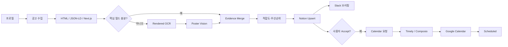

<div align="center">


# Campus Mate Harness

**여러 사이트에 흩어진 대학생 공모전 정보를 구조화하고,<br/>개인화 추천부터 Notion 승인·Slack 브리핑·Google Calendar 반영까지 연결하는 code-backed Claude Code Harness**

<p>
  <strong>한국어</strong> · <a href="./README.en.md">English</a>
</p>


</div>

---

## 🎯 해결하려는 문제

대학생 공모전과 대외활동 정보는 커리어 커뮤니티, 학교 게시판, 포털 등 여러 경로에 흩어져 있습니다. 사용자는 매번 직접 검색하고, 모집 자격과 제출물, 마감일을 읽어 정리한 뒤 일정을 다시 캘린더에 옮겨야 합니다.

Campus Mate는 이 반복 과정을 **수집 → 구조화 → 추천 → 승인 → 일정화**의 하나의 흐름으로 연결합니다. 공고를 자동으로 추천하더라도 참가 결정은 사용자가 Notion에서 `Accept`로 명시해야 하며, 승인된 항목만 Google Calendar에 반영합니다.

프로젝트 발표에서도 Timely Orchestrator가 Python Script와 LLM을 이용해 공고 수집, 3단계 파싱, 적합도 계산, 현황판 동기화, 충돌 검사와 승인 반영을 수행하고, Notion·Calendar·브리핑으로 결과를 연결하는 구조로 설계했습니다.

---

## 🧩 Harness 구조

이 저장소는 단순한 Python 애플리케이션도, 실행 코드가 없는 프롬프트 모음도 아닙니다.

```text
Claude Code Harness
├── .claude/agents/       역할·권한·입출력·검증·handoff
├── .claude/skills/       단계별 방법론과 실행 절차
├── CLAUDE.md             프로젝트 불변식과 코드 규칙
├── spec.md               기능·비기능 요구사항
├── workflow.md           phase와 복구 흐름
└── role-table.md         Agent ↔ Skill ↔ Code ↔ Output 매핑

Python execution layer
├── src/campus_mate/      수집·파싱·추천·연동 로직
├── tests/                자동 검증
└── timely/               스케줄·connector 배포 매핑
```

`.claude/`는 Claude Code가 프로젝트 수준의 subagent와 skill을 자동 발견하는 공식 경로입니다. 초기 제출본의 `.pi/` 정의는 개념과 역할을 보존하되, 최종본에서는 Claude Code reference와 동일한 `.claude/` 구조로 통합했습니다.

---

## 🤖 에이전트 팀

### 6개 기능 Agent

| Agent | 역할 | 주요 산출물 |
|---|---|---|
| `profile-manager` | 학교·학년·전공·관심 분야 온보딩 | `user_profile.json` |
| `source-collector` | 지원 사이트 신규 URL 수집·중복 제거 | collection report |
| `multipass-parser` | HTML → OCR → Poster Vision, 근거 병합 | structured opportunities |
| `fit-priority` | 적합도·우선순위·추천 이유 | recommendation fields |
| `notion-dashboard` | 비파괴 upsert, 사용자 상태 보존 | Notion pages/state |
| `schedule-notification` | 충돌·Slack·Accept→Calendar | briefing/calendar artifacts |

### 3개 운영 Agent

| Agent | Timely 주기 | 조합되는 기능 |
|---|---:|---|
| `daily-collector` | 매일 08:00 | 수집·파싱·추천·Notion·충돌 |
| `slack-briefing` | 매일 09:00 | 추천 브리핑 |
| `accept-sync` | 매시 정각 | Accept 감지·Calendar·Scheduled |

발표자료의 6-Agent 구조와 실제 운영의 3개 스케줄 Agent는 서로 다른 수준입니다. 전자는 **업무 책임**, 후자는 **배포·실행 단위**입니다.

---

## 🛠️ 18개 Skill

메인 진입점은 `/campus-mate-orchestrator`입니다. 나머지 Skill은 파싱, 점수, 동기화와 QA 계약을 담당합니다.

```text
orchestration
├── campus-mate-orchestrator
├── campus-mate-onboarding
├── campus-mate-demo
└── qa-audit

collection / parsing
├── source-watchlist-crawl
├── html-opportunity-parse
├── rendered-page-ocr
├── poster-vision-extract
└── schema-merge-and-validate

recommendation
├── profile-build
├── interest-keyword-expand
├── fit-score-rank
└── deadline-priority-rank

integration
├── notion-dashboard-sync
├── calendar-freebusy-check
├── calendar-event-create
├── accept-state-sync
└── slack-brief-generate
```

각 Agent와 Skill은 단순 설명이 아니라 다음을 명시합니다.

- 호출 조건과 담당하지 않는 범위
- 입력·출력 경로와 데이터 계약
- 품질 게이트와 금지 동작
- 다음 Agent handoff
- 실패·부분 성공·재시도 정책
- 실제 Python 모듈과 테스트 파일

---

## 🔄 전체 워크플로



핵심 상태는 다음과 같습니다.

```text
New → Recommended → Accept → Scheduling → Scheduled
                     ├→ Hold
                     └→ Reject

파싱 검토 필요: NeedsReview
캘린더 실패: CalendarError → retry
```

---

## 🧠 Code-backed Harness

Agent가 코드를 대신하는 구조가 아니라, Agent가 **코드를 언제 어떤 조건으로 실행하고 결과를 어떻게 검증할지**를 정의합니다.

| Harness contract | Execution code |
|---|---|
| HTML evidence 우선, 충돌 시 review | `parsing/html.py`, `parsing/merge.py` |
| 0–100 설명 가능한 적합도 | `services/recommendation.py` |
| Notion 전체 삭제 금지, 상태 보존 | `integrations/notion.py` |
| Accept만 calendar 요청 | `integrations/calendar_bridge.py` |
| 부분 실패 시 성공 event ID 보존 | `workflows/accept_sync.py` |
| dry-run Slack 검수 | `workflows/brief.py` |

---

## 🚀 사용 방법

### 1. 설치

```bash
python -m venv .venv
source .venv/bin/activate        # Windows: .venv\Scripts\activate
python -m pip install -e '.[ocr,vision,dev]'
python -m playwright install chromium
cp .env.example .env
```

### 2. Claude Code Harness 실행

프로젝트 루트에서 Claude Code를 실행하면 `.claude/agents/`와 `.claude/skills/`가 자동 발견됩니다.

```text
“Campus Mate 온보딩 시작”
“fixture로 Campus Mate 시연 시작”
“오늘 공고 수집하고 Notion에 반영해줘”
“Slack 브리핑 dry-run 해줘”
“Notion Accept 항목 승인 반영해줘”
“파싱 단계만 다시 실행해줘”
```

또는 직접:

```text
/campus-mate-orchestrator demo
/campus-mate-onboarding
/campus-mate-demo fixture
```

### 3. Python CLI

```bash
campus-mate profile init
campus-mate collect --source linkareer --limit 8
campus-mate brief --dry-run --output artifacts/slack-briefing.json
campus-mate calendar plan --output artifacts/calendar-requests.json
```

자세한 단계와 Timely 배포는 [`workflow.md`](./workflow.md)와 [`docs/timely-deployment.md`](./docs/timely-deployment.md)를 참고합니다.

---

## 🧪 외부 연결 없는 재현 데모

```bash
cp examples/profile.example.json data/user_profile.json
CAMPUS_MATE_STORAGE_BACKEND=json \
  campus-mate demo --fixture examples/fixtures/linkareer_detail.html

campus-mate list
```

fixture 데모는 파싱·추천·idempotent JSON 저장을 확인하는 개발 검증용입니다. 실제 운영 구조는 Timely + Notion + Slack + Google Calendar입니다.

---

## ✅ 검증

```bash
python -m pytest -q
python scripts/validate_harness.py
python scripts/scan_secrets.py .
python -m compileall -q src scripts
```

최종 패키지에서는 다음을 검증합니다.

- 9개 Agent와 18개 Skill의 frontmatter 및 상호 참조
- `.pi/` 제거와 `.claude/` canonical structure
- HTML/OCR/multipass merge
- 적합도 scoring
- Notion 상태 보존 upsert
- Slack payload
- Calendar idempotency와 부분 실패 복구
- 비밀정보 패턴 부재

---

## 📁 저장소 구조

```text
campus-mate-harness/
├── .claude/
│   ├── agents/                 # 9개 Agent
│   ├── skills/                 # 18개 Skill + references/templates
│   ├── hooks/                  # secret guard / audit hooks
│   └── settings.json
├── CLAUDE.md
├── spec.md
├── workflow.md
├── role-table.md
├── docs/
├── timely/
├── src/campus_mate/
├── tests/
├── examples/
├── materials/
└── _workspace/
```

---

## 📌 현재 지원 범위

- 완전 지원 source: Linkareer
- OCR: Playwright/Tesseract 선택 기능
- Poster Vision: compatible vision endpoint 설정 시 선택 기능
- Notion: 현황판·승인 상태·포스터·추천 정보
- Slack: 일일 one-way briefing
- Calendar: Timely/Composio manifest bridge

미구현 사이트나 설정되지 않은 Vision 기능을 실제 운영 기능으로 과장하지 않습니다. 상세 제한은 [`docs/known-limitations.md`](./docs/known-limitations.md)에 정리했습니다.

---

## 📎 프로젝트 자료

| 자료 | 링크 | 내용 |
|---|---|---|
| 발표자료 | [2026 Campus Mate 발표자료](./materials/2026-campus-mate-presentation.pptx) | 문제 정의, 시스템 구조, 6개 기능 역할과 자동화 흐름 |
| 발표 대본 | [7분 발표 대본](./materials/2026-campus-mate-7min-script.docx) | Timely 시연과 Notion·Slack·Calendar 연결 설명 |

---

## 👥 프로젝트

- **Project** — Campus Mate: 대학생 공모전 일정 자동 관리 에이전트
- **Event** — Harness Engineering: AI Agent & Skill Hackathon
- **Result** — Finalist, 7 of 12 teams
- **Role** — Team · Architecture & Development Lead

원 발표자료는 Timely를 중심으로 사용자 프로필, 3단계 파싱, Notion 현황판, Google Calendar, Slack 브리핑을 연결하고, 프로필 관리·공고 수집·멀티패스 파싱·맞춤 추천·현황판 동기화·일정/알림 관리의 여섯 역할을 제시했습니다.

---

## 🔐 보안과 라이선스

실제 토큰은 환경변수 또는 Timely Secrets에만 저장합니다. `.claude` hook과 CI secret scan이 흔한 credential 패턴의 기록을 차단·검사합니다.

팀 공동 코드의 공개 라이선스는 팀원 간 합의 후 추가하는 것을 권장합니다. 현재 패키지는 별도의 오픈소스 라이선스를 부여하지 않습니다.
