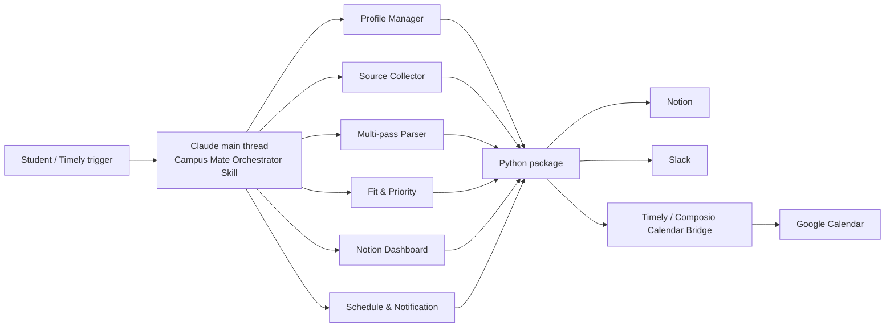

# Architecture

## Why `.claude/`

`.claude/agents/` and `.claude/skills/` are the project-level discovery paths used by Claude Code. The previous `.pi/` directory represented the Timely/competition workspace convention used in the prototype; Claude Code does not automatically treat `.pi/` as project subagents or skills. This package therefore makes `.claude/` canonical and keeps Timely-specific schedules under `timely/`.

## Two orchestration layers



The Claude main thread must coordinate the subagents because custom subagents are isolated workers and do not recursively create other subagents. The orchestrator skill remains in the main context and chains bounded work.

## Six functional roles versus three scheduled agents

The six roles describe system responsibilities. The three scheduled agents describe deployment units. This is intentional consolidation, not a contradiction.

```text
Six roles
  profile + source + parser + recommendation + dashboard + schedule/notification
                              ↓ composed into
Three scheduled operations
  daily-collector + slack-briefing + accept-sync
```

## Code modules

```text
src/campus_mate/
├── models.py              # cross-phase contracts and state enums
├── config.py              # environment-backed settings
├── sources/               # supported website adapters
├── parsing/               # HTML, OCR, vision, evidence merge
├── services/              # onboarding and recommendation
├── integrations/          # Notion, Slack, calendar manifest bridge
└── workflows/             # runnable phase compositions
```

## Current implementation truth

- Linkareer is the complete production source adapter.
- OCR is optional and depends on Playwright/Tesseract.
- Poster vision is optional and depends on an OpenAI-compatible vision endpoint.
- Notion and Slack are called by the Python package.
- Google Calendar event creation is represented as a manifest/result bridge so Timely/Composio performs connector calls.
- JSON storage supports deterministic local tests and demo runs.
